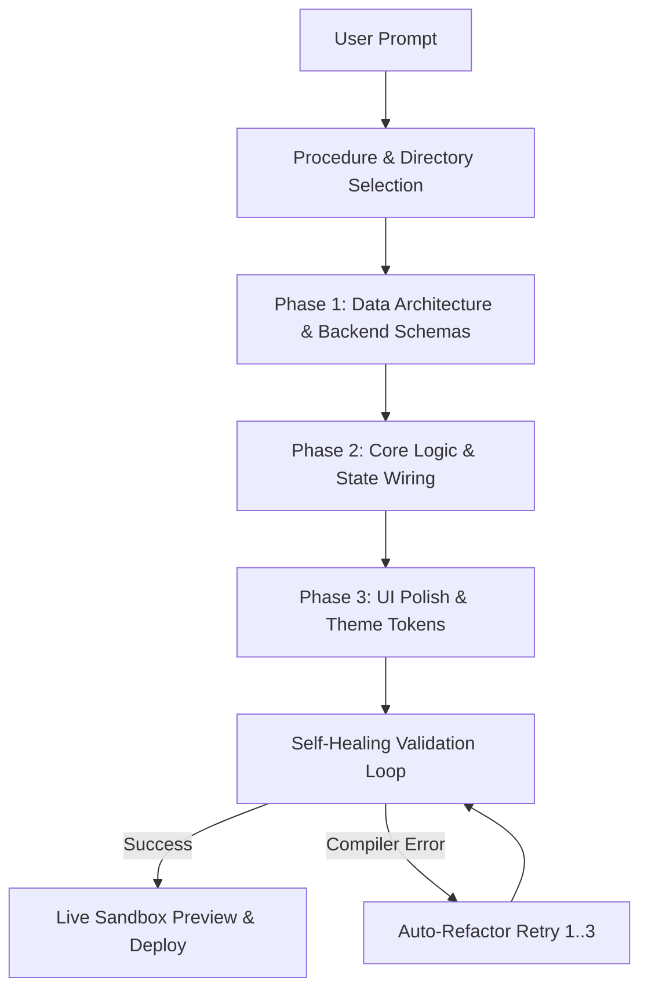

# ⚡ Velocity (AI-CODER-APP)

An autonomous, local AI app builder utilizing a strict backend-first generation pipeline, interactive directory targeting, real-time price estimation, and structured self-healing reasoning.

Created & Maintained by **Dishan Naik**.

---

## 📸 Interface Preview


---

## 🔥 What Makes Us Different?

Unlike black-box cloud code generators, Velocity gives developers **total control, transparent telemetry, and zero vendor lock-in**:

1. **🔒 100% Privacy & Zero Relay Server:** Your API keys and source code are stored exclusively on your device. Direct client-to-LLM requests.
2. **💵 Real-Time Price & Token Estimator:** Instant cost calculation for Groq, Gemini, OpenRouter, OpenAI, and Anthropic before executing prompts.
3. **⚡ Interactive Procedure & Target Directory Selector:** Choose exact target folders (`src/app`, `artifacts/ai-coder-app`) and component layouts directly inside the chat interface.
4. **🧠 Exposed Reasoning & Thinking Animation:** Watch the agent plan, configure directories, design architecture, and execute code step-by-step.
5. **🔄 Self-Healing Agent Loop:** Intercepts syntax or compiler errors, feeds stack traces back to the LLM, and refactors autonomously (up to 3 retries).
6. **🗄️ Auto-Provisioned Backend & Deploy Pipeline:** Auto-generates Supabase database clients (`lib/supabase.ts`), SQL schemas (`schema.sql`), and deployment scripts (`vercel.json`, `.github/workflows/ci.yml`).

---

## 🏗️ Core Architecture (The Fixed Framework)

To prevent scope creep and hallucination, Velocity enforces a rigid technology stack:

* **Framework:** Next.js (App Router) / Vue 3 + Vite / React Native.
* **Language:** TypeScript (Strict Mode).
* **Styling:** Tailwind CSS.
* **UI Engine:** Shadcn/ui & DaisyUI (Reusable, accessible component tokens).
* **State Management:** Zustand / Pinia / React Context.

---

## ⚙️ 3-Phase Generation Pipeline

The AI agent operates in strict, sequential phases:



1. **Phase 1: Backend & Data Architecture (Backend-First)**
   - Define data models, schemas, and state management stores first.
2. **Phase 2: Core Logic Integration**
   - Wire state management to basic HTML/JSX scaffolds to validate business logic.
3. **Phase 3: UI Polish & Theming**
   - Apply theme engines (Shadcn/DaisyUI) for clean, accessible interfaces.

---

## 📊 Telemetry & Observability

The Settings panel includes a real-time **Stats & Telemetry Dashboard**:

* **Token Consumption**: Input/Output token counter against provider rate limits.
* **Est. Session Cost**: Dollar cost calculator ($0.00 for Groq/Gemini/OpenRouter free tiers).
* **Active Target Directory**: Current target build folder (`src/app` / `artifacts/`).
* **Active Theme Engine**: Live color palette (Violet, Ember, Ocean).

---

## 🚀 Strategy & Future Roadmap

- [x] **Live WebContainer Sandbox Preview:** Live render preview of executing source code in browser.
- [x] **Self-Healing Loop:** Retries generation up to 3 times on compiler / stack trace errors.
- [x] **Database Auto-Provisioning:** Auto-scaffolds Supabase connection clients & relational schemas.
- [x] **One-Click Deploy & GitHub Sync:** Ships `vercel.json` and `.github/workflows/ci.yml`.
- [x] **Local Zero-Cost AI Execution:** Run refactoring loops through local Ollama (`qwen2.5-coder:7b` / `llama3.2`).
- [x] **E2B Infrastructure Provisioning:** Bash automation script for cloud sandbox templates (`bash scripts/provision-e2b-sandbox.sh`).

---

## 📊 Technical Benchmarking & Cost Comparison

Detailed performance and token cost benchmarks are published in [BENCHMARK.md](BENCHMARK.md):

* **85% Token Savings:** Via Progressive Disclosure Skills Routing.
* **70% Assembly Speedup:** Via Component Registries & Theme Packs.
* **Zero-Cost Refactoring:** Via Local Ollama adapter (`lib/ollamaAdapter.ts`).

---

## 🦙 Local Ollama & E2B Setup

To run Velocity with 100% free local models:

1. **Start Ollama Local Server:**
   ```bash
   ollama run qwen2.5-coder:7b
   ```
2. **Provision E2B Cloud Sandbox (Optional for heavy native builds):**
   ```bash
   bash scripts/provision-e2b-sandbox.sh
   ```

---

## 💡 Best Practices

1. **Keep Prompts Actionable:** Specify what app features you want built (e.g. *"Build a habit tracker with Supabase data storage"*).
2. **Use Free Tier Providers First:** Start with **Groq** or **Gemini** for instant, zero-cost generation.
3. **Isolate Local Secrets:** Keep local API keys in `lib/localKeys.secrets.ts` (gitignored). Never commit keys to public branches.

---

## 🛠️ How to Contribute

Contributions are welcome! Follow these steps to set up your environment:

1. **Fork & Clone Repository:**
   ```bash
   git clone https://github.com/your-username/velocity.git
   cd velocity
   ```

2. **Install Dependencies:**
   ```bash
   pnpm install
   ```

3. **Run Typecheck & Test Suite:**
   ```bash
   pnpm run typecheck
   pnpm test
   ```

4. **Start Development Server:**
   ```bash
   pnpm run dev
   ```

5. **Submit a Pull Request:**
   - Ensure all changes pass `pnpm run typecheck` and `pnpm test` with 0 errors.
   - Use standard PR templates provided in `.github/PULL_REQUEST_TEMPLATE.md`.

---

## 👤 Author & Maintainer

**Dishan Naik**  
*Lead Developer & AI Architect*  
- GitHub: [@dishannaik](https://github.com/dishannaik)

---

## 📄 License

This project is licensed under the MIT License — see the [LICENSE](LICENSE) file for details.